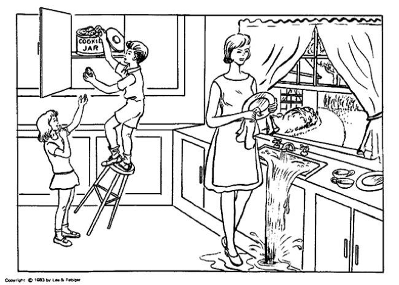

# Notebooks and other problems I liked

I have been digging into the field of NLP for the last couple of years, by sitting in the weekly meetups of a [local research group](http://nlp.cs.aueb.gr/), gettting into a [local competition](https://race.nbg.gr/challenge-details/wordembedding) and attending a [local summer school](https://www.youtube.com/playlist?list=PLSWgH7JB2-1G2h8wj-ecK8FfpX72Z80_B). 

All this local stuff has now moved in the digital realm, with COVID-19. So I tried to keep up by attending the NLP track for [online ICLR 2020](https://iclr.cc/virtual/index.html), and it was well worth it!

Here, I placed a couple of notebooks on problems I liked. Twitter sentiment analysis and more notably Alzheimer's text classification.

## Twitter Sentiment Analysis

The [first notebook](./Twitter_sentiment_analysis.ipynb) is a plain old tweet sentiment analysis on a large enough dataset. The solution is not even my own, I took it and worked on it from a notebook shared in Kaggle by [Paolo Ripamonti](https://twitter.com/ripamonti93). My contribution is on enabling the TPU's and providing comments or small suggestions.

I found the solution elegant for the given dataset, which was [Sentiment140](https://www.kaggle.com/kazanova/sentiment140). Paolo took advantage of the size of the dataset (1.6 million labeled tweets) and showcased the power of Word2Vec embeddings trained entirely on it. He proved then that when the embeddings are coupled with an LSTM and supervised training, we are off to a good start :)

## Alzheimer's text classification

The [second notebook](Alzheimer's_text_classification.ipynb) is an attempt to classify potential Alzheimer's onset on patients, using transcripts of their descriptions of a picture. This is a standard method for physicians to perform an initial screening evaluation, using the correlation of the impact of Alzheimer's, on a persons ability to coherently describe a viewed setting.

The idea to identify this automatically becomes interesting with modern NLP methods. I first came across the idea in the interesting research by [Vassiliki Rentoumi](https://scholar.google.gr/citations?user=je_Ldd8AAAAJ&hl=en).  As a first approach I used a notebook by [Jay Alammar's](https://twitter.com/JayAlammar) well known blog, with article titled [A Visual Notebook to Using BERT for the First TIme](http://jalammar.github.io/a-visual-guide-to-using-bert-for-the-first-time/).

Having only 60 (30 positive, 30 negative) labeled short text transcripts of [the Boston Cookie Theft](https://aspieantiquarian.wordpress.com/2015/01/01/the-boston-cookie-theft/) challenge, I needed a method that would work with only few labeled examples. So I adjusted Jay's notebook to use a destilled version of the famous pre-trained BERT language model, to work with my toy dataset. 

My short transcripts easily fitted in BERT's input limitation, and Jay smartly had found a way to use the model only as a feature extractor. With very little resources and no need for GPU's, the 768 features of [DistilBERT's](https://arxiv.org/abs/1910.01108) [CLS] token (which compresses information from the entire sequence), where fed into a simple linear classifier for supervised training. Nice!

The picture above is used for the Boston Cookie Theft Description Task
